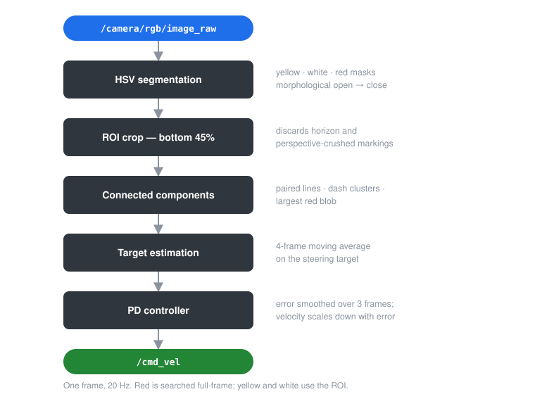
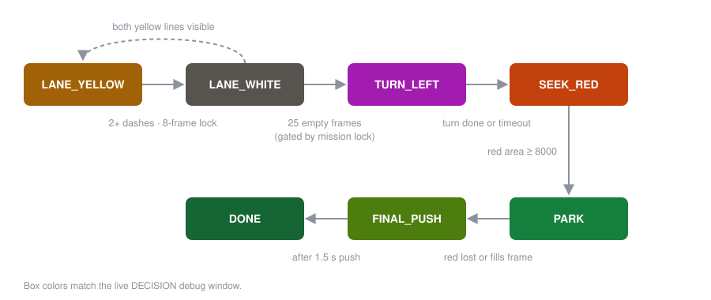

# TurtleBot3 AutoRace — Vision-Based Lane Following

Autonomous lane following for a **TurtleBot3 Burger** using a single RGB camera.
No LiDAR, no odometry, no map — every steering decision comes from a single
camera frame, at 20 Hz.

The robot completes a five-stage course: follow yellow lane boundaries, merge onto
a dashed white highway, detect a T-junction, execute a left turn without crossing
the lane, then locate and park on a red square.

**Result: full course completed autonomously in 4:11.22 with zero line crossings.**

| | |
|---|---|
| **Platform** | TurtleBot3 Burger + Raspberry Pi Camera |
| **Stack** | ROS Noetic · Python 3 · OpenCV · NumPy |
| **Sensing** | Monocular RGB only |
| **Control** | PD steering with error-adaptive velocity |
| **Course** | Capstone Design (ICE/CSE4020), Inha University, May 2026 |

📹 **[Robot run](https://youtu.be/nZOmZpWM95w)** · **[Debug view / screen capture](https://youtu.be/SDK73mEr38g)**

---

## Why this was harder than it looks

A lane follower is a first-week robotics exercise until you put it on real hardware
under classroom fluorescent lighting. The problems that actually cost us time were
not control theory:

- **Dashed lines break line detection.** The white highway markings are
  discontinuous, so Hough transforms and single-blob centroids both fail. We cluster
  dashes by image side and take an *area-weighted* centroid per cluster.
- **A curved lane looks like two lanes.** Connected-component analysis splits one
  sharply curved yellow line into multiple blobs. We reject blob pairs closer than
  `MIN_LINE_SEPARATION` apart and fall back to single-line tracking.
- **A single line is ambiguous.** When only one boundary is visible, is it the left
  one or the right one? On a sharp curve the right line drifts *past* the image
  midpoint. We keep a memory of the last known side and use hysteresis rather than a
  naive midpoint test.
- **The parking square is red — and so are false positives.** Triggering the parking
  sequence early would end the run. The final mission stage stays **locked** until
  the robot has provably traversed the white highway section.

Each of these is documented with the failing case and the fix in
**[docs/ARCHITECTURE.md](docs/ARCHITECTURE.md)**.

---

## Pipeline



Connected-component analysis replaced Hough line detection because it stayed stable
through curves and partial lane visibility, where Hough did not.

Velocity is not constant. Steering error scales the linear speed down toward
`MIN_SPEED` on sharp curves, which is what kept the robot inside the lines:

```python
speed_factor = min(1.0, abs_error / 150.0)
linear = MAX_SPEED - (MAX_SPEED - MIN_SPEED) * speed_factor
```

---

## Mission state machine



| State | Behavior |
|---|---|
| `LANE_YELLOW` | Track yellow boundaries with PD control; default state |
| `LANE_WHITE` | Center between dashed white lines via area-weighted clustering |
| `TURN_LEFT` | Two-phase turn: open-loop commit, then closed-loop yellow avoidance |
| `SEEK_RED` | Cruise forward, steer toward the red square |
| `PARK` | Slow centered approach until red fills the frame or reaches the base |
| `FINAL_PUSH` | Timed forward push to fully cover the square |
| `DONE` | Stopped, mission complete |

The **T-junction** is detected by absence rather than presence: 25 consecutive frames
with no yellow lines *and* no white dashes. Because that condition can also occur
briefly during normal driving, it is gated behind the `final_stage_unlocked` flag,
which only sets after 15 frames of confirmed highway driving.

The **left turn** is the one maneuver that cannot be done open-loop — the arc that
works on one battery charge overshoots on another. Phase A commits to the turn blind
for 1.0 s; Phase B then watches the yellow lines and pushes harder or eases off as
they encroach on a safety corridor around the image center, cutting linear velocity
to 30% if a line gets within 60 px.

---

## Repository layout

```
catkin_ws/src/lane_follower/
├── scripts/lane_follower.py     # the complete node (~850 lines)
├── launch/lane_follower.launch  # single-command startup
├── package.xml
└── CMakeLists.txt

docs/
├── ARCHITECTURE.md              # pipeline, state machine, failure cases
├── TUNING.md                    # every parameter and why it has that value
├── CALIBRATION.md               # three bugs found in the stock ROBOTIS pipeline
└── REPORT.pdf                   # original capstone report as submitted
```

---

## Documentation

| Document | Contents |
|---|---|
| **[ARCHITECTURE.md](docs/ARCHITECTURE.md)** | The full pipeline stage by stage, the mission state machine, and the concrete failure case behind each design decision |
| **[TUNING.md](docs/TUNING.md)** | Every parameter in the node, why it holds that value, and what to re-tune first for a different track |
| **[CALIBRATION.md](docs/CALIBRATION.md)** | Camera pose, and three bugs found in the stock ROBOTIS calibration pipeline — including one that produced plausible but wrong results |
| **[REPORT.pdf](docs/REPORT.pdf)** | The original capstone report submitted for assessment, May 2026 |

---

## Running it

**Prerequisites:** ROS Noetic on Ubuntu 20.04, a built TurtleBot3 workspace, and the
robot reachable over the network.

### 1 — Build

```bash
cd catkin_ws
catkin_make
source devel/setup.bash
```

### 2 — PC: ROS master

```bash
export ROS_MASTER_URI=http://<PC_IP>:11311
export ROS_HOSTNAME=<PC_IP>
export TURTLEBOT3_MODEL=burger
roscore
```

### 3 — Robot: bringup

```bash
ssh ubuntu@<ROBOT_IP>
export ROS_MASTER_URI=http://<PC_IP>:11311
export ROS_HOSTNAME=<ROBOT_IP>
export TURTLEBOT3_MODEL=burger
roslaunch turtlebot3_bringup turtlebot3_robot.launch
```

### 4 — Robot: camera

```bash
ssh ubuntu@<ROBOT_IP>
export ROS_MASTER_URI=http://<PC_IP>:11311
export ROS_HOSTNAME=<ROBOT_IP>
source ~/autorace_sbc_ws/devel/setup.bash
roslaunch turtlebot3_autorace_camera raspberry_pi_camera_publish.launch
```

### 5 — PC: lane driver

```bash
roslaunch lane_follower lane_follower.launch
```

Press **Q** in any debug window to stop the robot and exit. The node also publishes
zero velocity five times on shutdown so the robot cannot run away on Ctrl-C.

---

## Live debug view

The node renders five OpenCV windows. `DECISION` is the useful one — it overlays the
detected lines, the steering target, the turn safety corridor, and the parking line
on the camera feed, with a telemetry panel underneath (example readout):

```
>> STATE: LANE_WHITE <<
L=181 R=447 TGT=314 ERR=-6  MODE=WHITE_BOTH
LINEAR=0.10 m/s  ANGULAR=+0.02 rad/s
white_count=4  red_area=0  lost_lane=0
FINAL STAGE: UNLOCKED (white_frames=27, cooldown=0)
```

Being able to see *which* state the robot thought it was in, and *why*, is what made
tuning tractable — most of our failures were state-machine misfires, not bad gains,
and they were invisible without this panel.

---

## Results

| Metric | Value |
|---|---|
| Lap time | **4:11.22** |
| Line crossings | **0** |
| Manual interventions | **0** |
| Mission completion | Full course, all five stages |

Speeds were deliberately conservative (0.10 m/s cruise). The scoring rewarded clean
completion over raw pace, so we optimized for zero crossings rather than lap time.

**On simulation:** we could not produce a meaningful Gazebo-vs-hardware comparison —
the available laptops could not run the simulation fast enough for the timing numbers
to mean anything. All tuning was therefore done on the physical robot and track,
which is also why the HSV thresholds in [docs/TUNING.md](docs/TUNING.md) are specific
to the lighting of one classroom.

---

## Team & attribution

Built by **Team Donatello** for Capstone Design (ICE/CSE4020) at Inha University in
Tashkent, May 2026.

| ID | Name | Focus |
|---|---|---|
| U2210088 | **Sarvar Islamov** (Team Leader) | Workflow coordination, integration, parameter tuning |
| U2210013 | Fuzaylkhon Abdurakhimov | ROS setup, package configuration, calibration debugging |
| U2210077 | Gayday Aleksey | Control tuning, debugging, physical test iterations |
| U2210086 | Inomjonov Javohirbek | Lane detection, HSV threshold optimization |
| U2210099 | Kalimullin Rinat | Visualization, debugging tools, runtime testing |
| U2210122 | Shovkatjon Komilov | Architecture integration, documentation, test coordination |
| U2210251 | Javohirbek Xatamov | Hardware preparation, camera positioning, validation |

This is a **team project**, published here by the team lead as a portfolio record.
Code was developed collaboratively and consolidated on the team lead's machine, so
the upstream commit history does not reflect individual contribution.

Built on the [ROBOTIS `turtlebot3_autorace_2020`](https://github.com/ROBOTIS-GIT/turtlebot3_autorace_2020)
package, substantially extended and retuned for physical track conditions.

---

## References

- [ROBOTIS TurtleBot3 AutoRace 2020](https://github.com/ROBOTIS-GIT/turtlebot3_autorace_2020)
- [TurtleBot3 Autonomous Driving manual](https://emanual.robotis.com/docs/en/platform/turtlebot3/autonomous_driving/)
- [OpenCV — Changing Colorspaces](https://docs.opencv.org/4.x/df/d9d/tutorial_py_colorspaces.html)
- [`image_transport`](http://wiki.ros.org/image_transport)

## License

[MIT](LICENSE)
